# ARCHITECTURE.md
# Agency OS — Locked System Architecture
# Ratified: March 17 2026 | Authority: CEO (Claude) | Amended: March 18 2026 | Directives #217, #218
# Last validated: 2026-05-07 (Layer 1 SSOT alignment — Lemlist+SmartLead added to §3)
# DO NOT MODIFY without an explicit CEO directive that
# names this file and specifies the exact change.
#
# Elliottbot — this is the first thing you read.
# Every session. No exceptions.
# If this file is missing: stop, report to Dave,
# do not recreate it, do not proceed.

---

## RULE ZERO

Before writing any code that calls an external service:
1. Check SECTION 3 (DEPRECATED VENDORS) in this file
2. If the service is listed there — stop. Do not call it.
   Report to CEO immediately.
3. Check SECTION 4 (LIVE VENDORS) for the correct service,
   endpoint, env var, and cost for the tier you are building.

---

## PROJECT STRUCTURE

See [docs/project_structure.md](docs/project_structure.md) for the auto-generated directory tree. Regenerate via `find . -maxdepth 2 -type d` from repo root when top-level structure changes.

---

## SECTION 1 — WHAT IS SIEGE WATERFALL

Siege Waterfall is Agency OS proprietary orchestration
logic. It is NOT a vendor. It is NOT a service you call.
It is OUR CODE.

Siege Waterfall is the orchestration layer that:
- Decides which vendor to call, in what order
- Runs tiers in parallel where dependencies allow
- Applies fallback rules when a tier returns no data
- Validates enrichment output against confidence thresholds
- Tracks cost per lead across tiers
- Gates expensive tiers behind score thresholds

The vendors Siege Waterfall calls are in SECTION 4.
The orchestration logic lives in:
  src/integrations/siege_waterfall.py
  src/engines/scout.py

Siege Waterfall is never deprecated. It is our core IP.
Vendors inside it are replaced. The orchestrator improves.

---

## SECTION 2 — SYSTEM ARCHITECTURE OVERVIEW

```mermaid
flowchart LR
    ICP[Verify ICP] --> T0[T0 Discovery<br/>DataForSEO]
    T0 --> Bulk[Bulk insert<br/>lead_pool]
    Bulk --> ABN[BU ABN match<br/>local JOIN]
    ABN --> Act[Activate<br/>campaign]
    Act --> FB[Flow B fires<br/>async]
    FB --> Par[Parallel via asyncio.gather<br/>T1 / T1.25 / T1.5 / T2 / T3 / T-DM0]
    Par --> S2[Stage 2<br/>Person discovery]
    S2 --> S25[Stage 2.5<br/>Social presence<br/>Propensity ≥70]
    S25 --> S3[Stage 3<br/>T5 Mobile<br/>Propensity ≥85]
    S3 --> ALS[ALS Scoring]
    ALS --> OUT[Outreach Stack<br/>Salesforge / Unipile / ElevenAgents]
```

### FLOW A — Synchronous discovery (target under 6 minutes)
1. Verify ICP (2s)
2. Generate campaign name — Claude Haiku (11s)
3. Create draft campaign (1s)
4. T0 — Multi-category discovery — DataForSEO domain_metrics_by_categories (4 min, 400+ records)
   Source: src/pipeline/discovery.py — sweeps DFS domain_metrics_by_categories across all
   category codes matching the agency's services. Returns domain + GMB-equivalent fields
   (rating, review count, gmb_category) per business at $0.002/query.
   Bright Data GMB scrape is NOT primary T0 — it appears later as T2 backfill (Section 5)
   when T0 returns incomplete fields.
5. Bulk insert to lead_pool (2s)
6. business_universe ABN match — local Supabase JOIN (2s)
   NOT an API call. Query our own DB. Free and instant.
   Known issue: 0% match rate due to name format mismatch
   (e.g. "Acme Digital" vs "ACME DIGITAL PTY LTD").
   Fuzzy/trigram matching needed — tracked separately.
7. Bulk assign to campaign (2s)
8. Bulk promote to leads with all captured fields intact (2s)
9. Activate campaign (1s)
10. Fire Flow B (async, fire and forget)

### FLOW B — Async enrichment (target under 10 minutes)
batch_size: 500 (not 100)
No Clay budget cap. CLAY_MAX_PERCENTAGE is dead.

Parallel architecture — fire simultaneously per lead:
  GROUP A (all have domain from T0 DFS discovery, no dependencies):
    T1 — business_universe JOIN (local, free)
    T1.25 — ABR SearchByASIC (trading name, free)
    T1.5 — Bright Data LinkedIn Company
    T2 — Bright Data GMB scrape (full fields if T0 was incomplete — backfill only)
    T3 — Leadmagic email
    T-DM0 — DataForSEO ad spend + DM discovery (separate DFS endpoint from T0)
    All six fire via asyncio.gather() simultaneously.

  THEN (depends on T1.5 LinkedIn company URL):
    Stage 2 — Person discovery

  THEN (depends on Stage 2 person data):
    Stage 2.5 — Social presence (gated Propensity ≥70)
    T5 — Leadmagic mobile (gated Propensity ≥85)

  THEN:
    ALS Scoring (local, instant)

---

## SECTION 3 — DEPRECATED VENDORS

These must never appear as active code paths.
If found in code you are about to write or run: stop.
Report to CEO before continuing.

| Vendor      | Was used for       | Replaced by            |
|-------------|---------------------|------------------------|
| Clay        | Person enrichment   | Removed — not needed   |
| Hunter.io   | Email finding       | Leadmagic (T3)         |
|             |                     | EXCEPTION: Hunter email-finder active in Pipeline F v2.1 as L2 email fallback (score >= 70). See Section 5 T3. |
| Kaspr       | Mobile finding      | Leadmagic (T5)         |
| Proxycurl   | LinkedIn data       | Bright Data            |
| Apollo      | Contact database    | Bright Data + BU JOIN  |
| Apify       | Web scraping        | Bright Data            |
| Webshare    | Proxy rotation      | Bright Data            |
| SERP API    | Search results      | DataForSEO             |
| Direct mail | Outreach channel    | Removed permanently    |
| ZeroBounce  | Email validation    | Parked — do not build  |
| Lemlist     | Email outreach (proposed but never adopted) | Salesforge (Section 4 — wired and ready) |
| SmartLead   | Email infra (dropped from primary watchlist) | Salesforge (Section 4 — wired and ready) |

---

## SECTION 4 — LIVE VENDORS

These are the only external services called in production.

| Vendor                | Purpose                 | Env var               |
|-----------------------|-------------------------|-----------------------|
| DataForSEO            | T0 multi-category discovery (domain_metrics_by_categories) + T-DM0 ad spend + DM signals | DATAFORSEO_LOGIN |
|                       |                         | DATAFORSEO_PASSWORD   |
| Bright Data           | T2 GMB backfill (gd_m8ebnr0q2qlklc02fz), T1.5 LinkedIn Company, T-DM2 LinkedIn Profile, generic web scrape | BRIGHTDATA_API_KEY |
| ABR (data.gov.au)     | ABN + trading name      | ABN_LOOKUP_GUID       |
| Leadmagic             | Email + mobile          | LEADMAGIC_API_KEY     |
| Jina AI Reader        | Web scrape (free)       | None required         |
| Anthropic API         | Claude Haiku            | ANTHROPIC_API_KEY     |
| Salesforge            | Email outreach          | Verify with Dave      |
| Unipile               | LinkedIn outreach       | Verify with Dave      |
| ElevenAgents          | Voice AI (Alex)         | Verify with Dave      |
| Telnyx                | SMS outreach            | On hold until launch  |

Note: business_universe is a Supabase table we own.
T1 ABN lookup is a local JOIN — not an external API call.

---

## SECTION 5 — ENRICHMENT TIERS (COMPLETE SPEC)

### GMB Discovery fields (all 14 must be captured and
### promoted to leads table intact)
company_name, phone_number, company_website (open_website),
company_domain (derived), address, city, state (parsed),
company_country (AU), gmb_category, gmb_rating,
gmb_review_count, gmb_place_id, gmb_cid, latitude, longitude

---

### STAGE 1 — Company enrichment (parallel)

T1: business_universe JOIN
  Source: Supabase table (3.6M ABN records, already loaded)
  Method: local JOIN on company_name or domain
  Cost: FREE — no API call
  Returns: ABN, legal_name, trading_name, entity_type,
           state, postcode
  Known issue: 0% match rate — name format mismatch.
  Fix tracked separately. Do not block on this.

T1.25: ABR SearchByASIC
  Source: abr.business.gov.au SearchByASIC endpoint
  Env var: ABN_LOOKUP_GUID
  Cost: FREE
  Returns: trading_name, GST status, entity type,
           registered business names
  Purpose: resolves trading name from legal entity.
           Critical for GMB name matching.

T1.5: Bright Data LinkedIn Company
  Env var: BRIGHTDATA_API_KEY
  API key: 2bab0747-ede2-4437-9b6f-6a77e8f0ca3e
  GUID: d894987c-8df1-4daa-a527-04208c677c0b
  Cost: $0.0025 per record ($0.75 per 1,000)
  Bulk: 500 URLs per job
  Returns: company LinkedIn URL, employee count,
           industry, company posts (T-DM2b, free)

T2: Bright Data GMB full scrape
  Dataset: gd_m8ebnr0q2qlklc02fz
  Env var: BRIGHTDATA_API_KEY
  Cost: $0.001 per record
  Gate: skip if all 14 fields already captured at T0
  Returns: full GMB fields if T0 was incomplete

T2.5: Bright Data GMB Reviews
  Dataset: gd_luzfs1dn2oa0teb81
  Env var: BRIGHTDATA_API_KEY
  URL transform: !4m8!3m7+!9m1!1b1+?entry=ttu
  Cost: $0.001 per record
  Gate: Propensity >= 75 AND gmb_place_id present
  Returns: full review text, reviewer details
  Purpose: portfolio intelligence (reveals agency client
           names from review authors) + reputation signals

T3: Leadmagic email
  Env var: LEADMAGIC_API_KEY
  Cost: $0.015 per record
  Returns: verified work email + confidence score
  L2 fallback: Hunter.io email-finder (free, included in plan)
               Returns email if score >= 70 before Leadmagic call
  Replaces: Hunter.io primary role (now L2 fallback only)

T-DM0: DataForSEO
  Env var: DATAFORSEO_LOGIN, DATAFORSEO_PASSWORD
  Cost: $0.0045 per record
  Gate: all leads regardless of score
  Returns: DM name, title, LinkedIn URL, ad spend
           detected, job listings, SEO rankings,
           site traffic signals

---

### STAGE 2 — Person discovery
Requires: LinkedIn company URL from T1.5.
If T1.5 returns no company URL: Stage 2 skips entirely.

T-DM1: Bright Data LinkedIn DM Profile
  Env var: BRIGHTDATA_API_KEY
  Cost: $0.0015 per record
  Returns: full DM profile, seniority, tenure,
           connection count, confirms authority
  Title priority: Owner → Founder → Director → CEO → MD

---

### STAGE 2.5 — Social presence (gated, person level)
Requires: person LinkedIn URL from Stage 2.
Gate: Propensity >= 70 for all tiers in this stage.
Purpose: feeds ALS propensity scoring AND message
         personalisation. A message referencing what
         the DM posted last week is not cold outreach.

T-DM2: Bright Data LinkedIn DM Posts (90 days)
  Env var: BRIGHTDATA_API_KEY
  Cost: $0.0015 per record
  Returns: DM personal posts, engagement, topics
  Purpose: hook selection for outreach opener

T-DM2b: Company LinkedIn posts
  Cost: FREE — comes from T1.5 updates field
  No additional API call required
  Returns: company announcements, activity signals

T-DM3: Bright Data X (Twitter)
  Env var: BRIGHTDATA_API_KEY
  Gate: Propensity >= 70
  Legal: cleared for build (Mar 17 2026)
  Two separate endpoints — both required:

  Profiles API:
    Dataset: gd_lwxmeb2u1cniijd7t4
    Returns: DM + company X handle, profile metadata
    Cost: $0.0015 per record

  Posts API:
    Dataset: gd_lwxkxvnf1cynvib9co
    Returns: X posts 90d, engagement, topics
    Cost: $0.0015 per record

  Validation: 4-criterion layer rejects false positive
    handles before scoring.
  Purpose: DM public activity, frustrations, industry
    views — feeds propensity scoring + personalisation.

T-DM4: Bright Data Facebook page posts
  Env var: BRIGHTDATA_API_KEY
  Cost: $0.00075 to $0.0015 per post
  Gate: Propensity >= 70
  Returns: post content, date, engagement, hashtags
  Purpose: authentic local business voice signal

---

### STAGE 3 — Person enrichment
Requires: first_name + last_name + domain from Stage 2.
If Stage 2 returns no person: Stage 3 skips entirely.

T5: Leadmagic mobile
  Env var: LEADMAGIC_API_KEY
  Cost: $0.077 per record
  Gate: Reachability gap present AND Propensity >= 85
  Returns: verified direct mobile number
  Replaces: Kaspr (DEPRECATED — never reference)

---

### SCRAPER WATERFALL (for JS-heavy sites outside GMB)
Tier 2 — Jina AI Reader
  Endpoint: r.jina.ai/[target-url]
  Cost: FREE — always try first

Tier 3 — Bright Data Web Unlocker
  Env var: BRIGHTDATA_API_KEY
  Cost: pay per use — only if Jina fails

---

## SECTION 6 — ALS SCORING (PROPRIETARY)

Two separate scores. Never expose weights or raw scores
to agency customers. Dashboard shows priority rank and
plain English reason only. Weights are never documented
in code comments. This is our core IP.

REACHABILITY (100 points max)
Measures channel access — can we reach this lead?
  email confirmed: 40 points
  LinkedIn DM confirmed: 30 points
  mobile confirmed: 20 points
  LinkedIn URL only: 10 points

PROPENSITY (100 points max)
Measures fit and timing — should we contact them now?
Service-aware. ICP-configured per agency at onboarding.
Fed by: GMB signals, DataForSEO ad spend, T-DM2/2b/3/4
social posts, review trends, hiring activity, ABN age.
Weights: proprietary — never documented in code.

CIS — Conversion Intelligence System
Learns from campaign outcomes over time.
Scores improve as results feed back into the model.
Schema required before launch.

Gate thresholds:
  T2.5 GMB Reviews: Propensity >= 75
  T-DM2/2b/3/4 Social: Propensity >= 70
  T5 Mobile: Propensity >= 85

OPPORTUNITY SCORE (100 points max)
Identifies businesses with real scale but low digital presence — untapped potential.
Built by: src/engines/opportunity_scorer.py
Priority threshold: 60 points. Ratified: March 18 2026 | Directive #217.

Scoring signals:
  gmb_review_count >= 20:     +20
  gmb_review_count >= 40:     +10 bonus
  abr_age_years >= 5:         +20
  multiple_gmb_locations:     +15
  hiring_signals_detected:    +20
  structural_gap_industry:    +15
  no_ad_spend_detected:       +10
  low_organic_traffic (<500): +10

Lead classification:
  High Confidence (>=50) + High Opportunity (>=60) = Priority lead
  High Confidence (>=50) + Low Opportunity (<60)  = Standard lead
  Low Confidence (<50) regardless of opportunity  = Not enriched

Dashboard shows plain English reason only. Weights never exposed to agency customer.

---

## SECTION 7 — OUTREACH STACK

Active channels (in launch priority order):
  Email: Salesforge (dedicated infrastructure)
  LinkedIn: Unipile (DM + connection requests)
  Voice AI: ElevenAgents + Alex persona (Claude Haiku)
  SMS: Telnyx (on hold until post-launch)

Manual mode: every message reviewed before sending.
Autopilot mode: available after Manual validated.
Kill switch: pauses all campaigns instantly.
Always visible. Cannot be hidden.

---

## SECTION 8 — VALIDATION RULES

Company-level validation (Stage 1 output):
  found = True
  confidence >= 0.70
  company OR company_name present
  AND (domain OR phone OR gmb_place_id present)

CRITICAL: All GMB-discovered leads have gmb_place_id.
The _has_company_data fallback evaluates True for these
leads even when sources_used = 0. This is correct and
intentional. Do not remove this fallback. Do not weaken
this logic. It saves all 409 GMB leads from falling
through to deprecated Clay.

Person-level validation (Stage 3 output):
  email present
  first_name present
  last_name present
  company present

Confidence calculation:
  0 sources + gmb_place_id present: 0.70 (passthrough)
  1 source used: 0.80
  2 sources used: 0.85
  Formula: 0.75 + (sources_used × 0.05), floor 0.70

Pre-qualification gate (Directive #217):
  Confidence Score >= 50: proceed to Leadmagic enrichment
  Confidence Score < 50: store signals, skip Leadmagic, no contact data purchased
  Employee count feeds Confidence Score as one signal — never a hard gate

Quota loop (Directive #217):
  Flow B checks enriched count after each batch vs campaign monthly_quota
  If enriched < monthly_quota: trigger Flow A with next unswept location
  Loop continues until quota filled or market exhausted
  Market exhausted: log + notify agency owner, do NOT pad with disqualified leads

---

## SECTION 9 — ENVIRONMENT VARIABLES

| Variable             | Service            | Status on Railway  |
|----------------------|--------------------|--------------------|
| BRIGHTDATA_API_KEY   | Bright Data all    | Confirmed          |
| ABN_LOOKUP_GUID      | ABR endpoint       | Confirmed          |
| DATAFORSEO_LOGIN     | DataForSEO         | Confirmed          |
| DATAFORSEO_PASSWORD  | DataForSEO         | Confirmed          |
| LEADMAGIC_API_KEY    | Leadmagic T3 + T5  | VERIFY — absent    |
|                      |                    | from local env     |
| ANTHROPIC_API_KEY    | Claude Haiku       | Confirmed          |

LEADMAGIC_API_KEY was absent from local env per #210.
Confirm it exists on Railway before Directive #212.
Dave action required: verify Leadmagic key on Railway.

---

## SECTION 10 — KNOWN TECHNICAL DEBT

These are documented issues, not active blockers.
Do not fix without an explicit CEO directive.
Report if you encounter them. Do not route around them.

1. ✅ RESOLVED PR #200: Silent exception swallowing in
   scout.py — logger.error added to all silent blocks.
2. ✅ RESOLVED PR #200: Clay removed from scout.py —
   CLAY_MAX_PERCENTAGE, clay_budget, _enrich_tier2 gone.
3. ✅ RESOLVED PR #200: Stale _enrich_tier1 docstring
   updated to reference ARCHITECTURE.md Section 5.
4. ✅ RESOLVED PR #200: batch_size raised to 500 in
   enrichment_flow.py (source of the 100-lead cap).
5. business_universe match rate 0%: name format
   mismatch. Fuzzy matching needed. Separate directive.
6. Stage 2 person discovery: not yet built.
7. Stage 2.5 social presence: not yet built.
8. Message generation: untested with real data.
9. ✅ RESOLVED 2026-03-17: LEADMAGIC_API_KEY set on
   Railway via GraphQL upsert.

---

## SECTION 11 — SECURITY

### Authentication
- User auth: Supabase Auth (email + magic link)
- Bot auth: callsign-based via CALLSIGN env var (no per-bot password)
- Service-to-service: API keys + GUID/secret per vendor (see §9 ENVIRONMENT VARIABLES)

### Secret handling
- All API keys live in Railway env vars (production) or `~/.config/agency-os/.env` (local dev)
- NEVER commit keys to repo. `.env*` files are gitignored.
- Rotate via Railway dashboard or GraphQL API per memory pin `reference_railway_graphql.md`
- Pre-call SOP: query `elliot_internal.api_keys_ledger` before assuming a key works

### Network security
- All vendor APIs use HTTPS
- Bright Data scrapes via residential proxy (egress IP rotation handled by vendor)
- No incoming public endpoints from bot callsigns; FastAPI runs behind Railway router

### Data security
- PII (email, mobile, names) lives in Supabase
- Row-Level Security (RLS) gates per-agency access
- ALS proprietary scoring weights NEVER exposed to agency customer (per §6 ALS SCORING)

### Compliance
- AU SPAM Act: SMS requires explicit prior opt-in (Telnyx on hold until consent flow ratified — see §7 OUTREACH STACK)
- Email outreach: opt-out footer + sender authentication (SPF/DKIM/DMARC at registrar level)
- DNCR check before voice campaigns (Telnyx integration)

---

## SECTION 12 — GLOSSARY

Terms used throughout this document and in code. Defined ONCE here; referenced everywhere else.

- **Siege Waterfall** — Agency OS's proprietary orchestration layer (§1). NOT a vendor. The code that decides which vendor to call, in what order, with what gates.
- **Flow A** — synchronous discovery phase, target <6min. Builds the universe of fit-prospects (§2).
- **Flow B** — asynchronous parallel enrichment phase, target <10min. Per-lead via `asyncio.gather` (§2).
- **T0–T5** — enrichment tier numbering. T0 = discovery; T1-T5 = company + person enrichment stages (§5).
- **T-DM0–T-DM4** — decision-maker enrichment tier numbering. Person-level data acquisition (§5 Stage 2/2.5).
- **ABN** — Australian Business Number. 11-digit identifier from the Australian Business Register (ABR).
- **GMB** — Google My Business (now Google Business Profile). Source of T0 + T2 enrichment data.
- **ALS** — Agency Lead Scoring. Proprietary scoring system (§6) — Reachability + Propensity dimensions.
- **Reachability** — 100-pt score measuring channel access (email/LinkedIn/mobile confirmed).
- **Propensity** — 100-pt score measuring fit + timing. Service-aware, ICP-configured per agency at onboarding.
- **CIS** — Conversion Intelligence System. Learning component of ALS that improves scores from campaign outcomes.
- **Opportunity Score** — 100-pt score identifying businesses with scale but low digital presence (§6 OPPORTUNITY).
- **HOT tier** — leads scoring ≥85 Propensity. Active outreach campaign target.
- **WARM-PASSIVE tier** — high CIS but no recent trigger signal. Held in cold pool with periodic re-scan.
- **COLD-POOL** — high-fit prospects without active triggers. Held until trigger emerges; do not blind-send.
- **Pre-revenue** — current operating state. Zero paying customers; no social-proof claims permitted.
- **Bare pointer** — module file containing only a one-line link to ARCHITECTURE.md (per `docs/governance/SOP_ARCHITECTURE_SSOT.md` §4).
- **Drift detector** — Layer 6 hook (`scripts/ssot_drift_check.sh`) that fires on `SessionStart:clear` to catch module paraphrase regressions.

---

## SECTION 13 — DEV & TESTING ENVIRONMENT

### Local setup
- Python virtualenv at `/home/elliotbot/clawd/venv/`
- Frontend: Next.js — `cd frontend && npm install`
- Local DB: Supabase project shared with prod (no separate dev instance currently)
- Env vars: `~/.config/agency-os/.env` (local) mirrors Railway prod set

### Test infrastructure
- pytest markers: `live` (real API calls, opt-in via `pytest -m live`), `integration`, `e2e`
- Default test run: `pytest -m "not live"` (offline, mocks)
- Live-smoke tests cover 1 connector each (per `docs/audits/2026-05-07_connector_live_smoke_audit.md`)
- CI runs `ruff check src/` + `ruff format --check src/` + scoped pytest on PRs

### Sandbox accounts
- Most vendors offer free/trial tiers (Adzuna, Hunter limited)
- Bright Data dev workspace separate from prod (cost-controlled)
- Lemlist/SmartLead — NOT IN STACK (deprecated per §3 DEPRECATED VENDORS)

### Worktree convention
- Elliot main: `/home/elliotbot/clawd/Agency_OS/`
- Aiden: `/home/elliotbot/clawd/Agency_OS-aiden/`
- Atlas (clone): `/home/elliotbot/clawd/Agency_OS-atlas/`
- Scout (research): `/home/elliotbot/clawd/Agency_OS-scout/`

---

## SECTION 14 — FUTURE ROADMAP

Forward-looking work. Distinct from §10 (reactive technical debt). Items here represent direction, not commitment.

### Phase 1a — Density-rerank cohort validation (current)
- Build: density score module, NEGATIVE filter, cohort harness, CIS-band stratification
- Cohort: 50/arm parallel A/B (CIS-ordered control vs density-reranked variant)
- Pre-cohort sweep: BD LinkedIn + BD GMB + ABN live-smoke (PR #602 closed checklist item #7)
- Gate: Dave's two-phase re-scope approval

### Phase 1b — Connector additions (conditional on 1a baseline)
- Pre-registered ranking: (1) Adzuna jobs, (2) ASIC officer changes, (3) WHOIS, (4) ASIC strike-off (NEGATIVE strengthening), (5) Seek-via-BD fallback
- Stop rule: stop adding when marginal lift on primary metric falls below 1pp (noise floor)

### Phase 2 — Outreach validation
- First 100-prospect cohort end-to-end (enrichment → scoring → tier → outreach → reply)
- Dependency: Phase 1a baseline established + Salesforge integration live-tested

### Phase 3 — Pipeline F v2.2 / consolidation
- Merge `pipeline_orchestrator` streaming shell with `cohort_runner` `_run_stage` functions (Option C, ratified 2026-05)
- Cutover: enable `relay-consumer.service`, disable old `inotifywait` watchers
- Gate: Dave-only

### Long-horizon
- Workforce platform-play (Keiracom Workforce thesis) — deferred until Agency OS reaches paying-customer milestone
- Multi-agency federation (single Agency OS instance serving N agencies)
