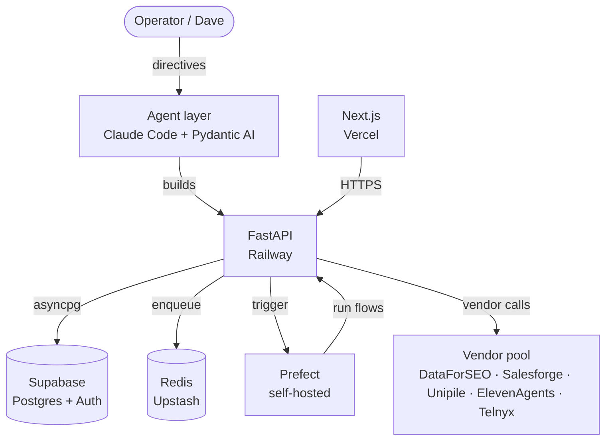
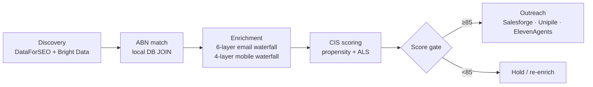
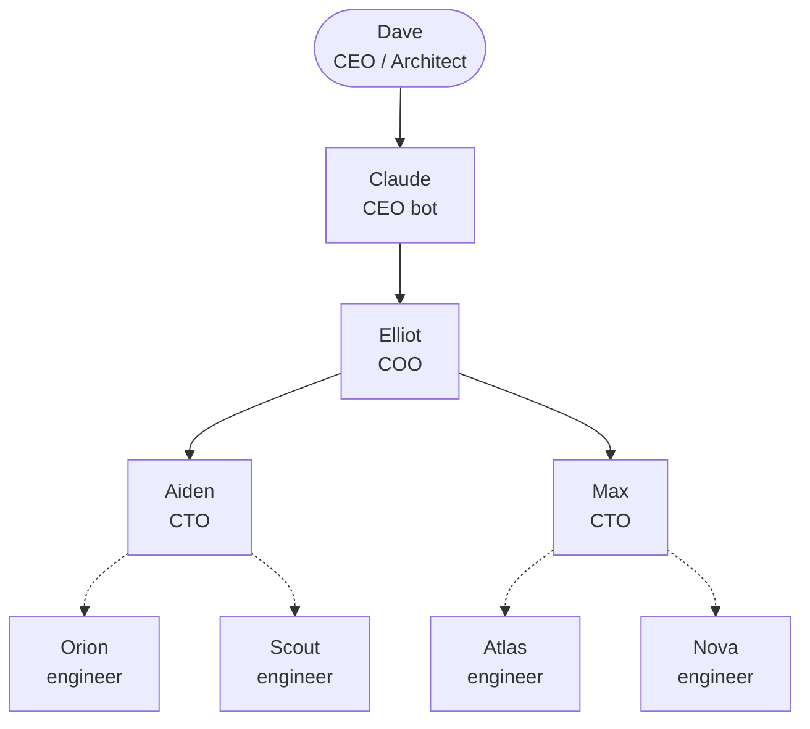
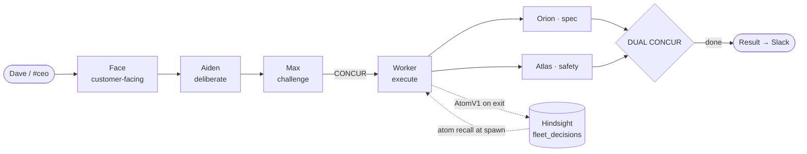

# Agency OS

> Automated acquisition engine for Australian marketing agencies — discovers Australian SMBs via Google Maps, enriches contact data through a multi-tier waterfall, scores leads with a Competitive Intelligence Score (CIS), and executes personalised outreach campaigns.

**Status:** In development (pre-revenue, private beta cohort opening soon).

---

## Architecture at a glance



The platform sits between a Next.js operator UI and a vendor pool. FastAPI carries request handling and contract enforcement; Prefect orchestrates long-running enrichment flows; Supabase holds tenant data, lead records, and CIS state; Redis fans out async work. Full topology lives in [ARCHITECTURE.md](ARCHITECTURE.md).

---

## Pipeline (Siege Waterfall)



Discovery surfaces Australian SMBs from Google Maps via DataForSEO and Bright Data. Each domain is matched against the ABN registry, then run through a tier-gated enrichment waterfall (cheaper tiers first, expensive tiers gated on propensity score). The Competitive Intelligence Score (CIS) decides whether a lead enters the outreach stack. Vendor selection lives in [ARCHITECTURE.md §SECTION 4](ARCHITECTURE.md); pipeline stages live under `src/pipeline/`.

---

## Agent layer



Agents are Claude Code sessions running under fixed callsigns. Deliberation tier (Elliot, Aiden, Max) reviews and approves; engineer tier (Orion, Atlas, Scout, Nova) builds. Every directive flows through Step 0 RESTATE → Decompose → Execute → Verify → Report. Inter-agent comms run through a Slack relay; persistent state lives in Supabase `agent_memories`.

---

## Agent loop architecture (V1 chain)

The runtime execution loop — distinct from the callsign org chart above — moves every request through a fixed chain: **Face → Aiden + Max (deliberate) → Worker → Orion + Atlas (review) → done.** The roles run as separate ephemeral spawns and never share in-process state; each exits after its turn and hands off through **AtomV1 pointers** carried over NATS, with the atoms themselves living in Hindsight.



**Face** — the customer-facing ephemeral agent. It receives Dave's intent from Slack (a `claude-haiku-4-5` agent spawns per `#ceo` message via Socket Mode, rate-capped at 10 spawns/hour via Valkey), classifies it as *answer / dispatch / clarify*, dispatches build work to Aiden, and reports completion back to Dave. It presents one recommendation, never a pros-and-cons list.

**Deliberators (Aiden + Max)** — two agents that must agree before any work is dispatched. **Aiden** (Deliberator 1, architect) produces a structured KEI work plan and is biased toward action. **Max** (Deliberator 2, challenger) stress-tests that KEI and returns CONCUR or BLOCK with one sentence per gap — he will not rubber-stamp. Both must CONCUR before the Worker is dispatched.

**Worker** — the executor. It receives an atom pointer, fetches the KEI from Hindsight, builds/writes/fixes, writes an AtomV1 atom on exit, and signals the reviewers. Operationally each Worker is an ephemeral spawn off the work-loop: a Postgres `trg_tasks_unblock_dependents` trigger publishes `task_id + callsign + tenant_id` to the Valkey `keiracom:tasks:available` queue; the consumer checks the tenant's tier ceiling and, if under the concurrent-spawn limit, calls `POST /dispatcher/spawn` (overflow is requeued, never dropped; a Valkey lock prevents duplicate spawns). Each spawn is hydrated by a 4-layer context contract — L1 system prompt, L2 Hindsight recall, L3 Valkey spend gate, L4 dispatcher wiring — fail-open at every layer.

**Reviewers (Orion + Atlas)** — dual concur before anything is marked complete. **Orion** (Reviewer 1, spec) verifies the output against the KEI line by line. **Atlas** (Reviewer 2, quality + safety) checks production readiness — regressions, edge cases, data integrity. Each returns CONCUR or REJECT; **both** must CONCUR before merge/completion — neither concurs alone. Runtime and governance PRs ride this same dual-concur gate (the orchestrator-merge-after-NATS-concur pattern) before an admin squash-merge.

**Hand-off via AtomV1 pointers** — roles do not pass state in process. An exiting agent writes its decision as an AtomV1 atom to the Hindsight `fleet_decisions` bank; NATS then carries the `task_id + atom_id` to the next agent, which recalls the atom at spawn (~100–150 tokens, no repeated preamble). Postgres carries operational state and the task-unblock triggers; Hindsight carries all knowledge — there is no intermediate store. All agent invocations run on the Anthropic API, and results return to Slack via the dispatcher `task_complete` endpoint plus `slack_relay.py`. Each role's prompt is served at spawn from the `public.persona_bank` table (5 rows — face/aiden/max/orion/atlas) via `GET /dispatcher/persona`. Post-cutover, `ceo_memory` is an audit log and admin target — not a pipeline step.

---

## Quickstart

Targets a fresh clone building locally in under 30 minutes.

```bash
# 1. Clone
git clone https://github.com/Keiracom/Agency_OS.git
cd Agency_OS

# 2. Python backend
python3 -m venv .venv
source .venv/bin/activate
pip install -r requirements.txt

# 3. Frontend
cd frontend && pnpm install && cd ..

# 4. Env
cp config/.env.example .env  # then fill in SUPABASE_DB_URL, ANTHROPIC_API_KEY, etc.
cp frontend/.env.example frontend/.env.local

# 5. Verify
pytest -x -q                         # backend tests
cd frontend && pnpm test && cd ..    # frontend tests
ruff check src/                      # lint

# 6. Run backend locally
uvicorn src.api.main:app --reload --port 8000

# 7. Run frontend locally
cd frontend && pnpm dev
```

Backend at <http://localhost:8000> (OpenAPI at `/docs` in non-prod). Frontend at <http://localhost:3000>.

---

## Stack

| Layer | Tech |
|-------|------|
| Backend API | FastAPI · Pydantic AI · asyncpg |
| Frontend | Next.js · React · Plasmic |
| Database | Supabase (Postgres + Auth + RLS) |
| Cache / queue | Redis (Upstash) |
| Orchestration | Prefect (self-hosted) |
| Compute | Railway (backend) · Vercel (frontend) |
| Observability | Sentry · Better Stack · structlog |
| Agent harness | Claude Code (Anthropic) |

Detailed vendor list, costs, and tier rules in [ARCHITECTURE.md §SECTION 4](ARCHITECTURE.md).

---

## Documentation

| Doc | Purpose |
|-----|---------|
| [ARCHITECTURE.md](ARCHITECTURE.md) | Locked system architecture — vendors, pipeline, deprecations |
| [CONTRIBUTING.md](CONTRIBUTING.md) | Local dev, PR process, KEI workflow |
| [CLAUDE.md](CLAUDE.md) | Instructions for Claude Code agents |
| [PROJECT_BLUEPRINT.md](PROJECT_BLUEPRINT.md) | Phase plan + import hierarchy |
| [docs/governance/CONSOLIDATED_RULES.md](docs/governance/CONSOLIDATED_RULES.md) | The 7 ratified governance rules |
| [docs/phases/](docs/phases/) | Per-phase specifications |
| [docs/runbooks/](docs/runbooks/) | Operational procedures |

---

## License

Proprietary. © Keiracom.
