# Agency OS — Single Source of Truth

> How Agency OS works, end to end. From signup to signed client.

---

## System Flow Overview

```mermaid
flowchart TB
    subgraph Phase1["Phase 1: Onboarding"]
        A[User enters website URL] --> B[Maya analyzes website]
        B --> C[ICP extracted automatically]
        C --> D[Email & phone auto-provisioned]
        D --> E[Optional: Connect HubSpot & LinkedIn]
        E --> F[Dashboard unlocked]
    end

    subgraph Phase2["Phase 2: Discovery"]
        F --> G[Campaign created & activated]
        G --> H{Industry type?}
        H -->|Local services| I[Maps-first discovery]
        H -->|B2B/Professional| J[ABN-first discovery]
        H -->|Premium| K[Parallel discovery]
        I --> L[Raw leads collected]
        J --> L
        K --> L
    end

    subgraph Phase3["Phase 3: Enrichment"]
        L --> M[Tier 1: ABN Bulk - FREE]
        M --> N[Tier 2: GMB & Ads Signals]
        N --> O[Tier 3: Email Finder]
        O --> P[Tier 5: Mobile Finder]
        P --> Q[ALS Score calculated]
        Q --> R[Leads appear on scoreboard]
    end

    subgraph Phase4["Phase 4: Outreach"]
        R --> S{Lead tier?}
        S -->|Hot 85+| T[All channels: Email + LinkedIn + SMS + Voice]
        S -->|Warm 60-84| U[Email + LinkedIn]
        S -->|Cool/Cold| V[Email only]
        T --> W[Personalized sequences sent]
        U --> W
        V --> W
    end

    subgraph Phase5["Phase 5: Conversion"]
        W --> X[Replies detected]
        X --> Y[Intent classified by AI]
        Y --> Z{Intent type?}
        Z -->|Interested| AA[Escalate to meeting]
        Z -->|Objection| AB[Auto-handle or escalate]
        Z -->|Not interested| AC[Mark closed]
        AA --> AD[Meeting booked]
        AD --> AE[Lead converts to client]
    end

    style Phase1 fill:#1a1a2e,stroke:#f59e0b
    style Phase2 fill:#1a1a2e,stroke:#f59e0b
    style Phase3 fill:#1a1a2e,stroke:#f59e0b
    style Phase4 fill:#1a1a2e,stroke:#f59e0b
    style Phase5 fill:#1a1a2e,stroke:#f59e0b
```

---

## Phase 1: Onboarding

### What the User Experiences

When a new user arrives at Agency OS, they land on a clean, dark-themed onboarding screen with a prominent logo and the headline "Your digital employee is ready to work." The interface has a sophisticated Bloomberg Terminal aesthetic with warm amber accents against deep charcoal backgrounds.

In the bottom-right corner of the screen, Maya—the AI assistant—appears as a glowing amber ring avatar. The ring pulses gently, breathing with soft amber light to indicate Maya is present and active. Above her avatar, a floating panel displays her current status as "SCANNING" with a contextual message: "Analysing your website for insights..."

The user sees a single input field asking for their agency website URL. As they type, the system validates the URL format in real-time. Below this field, a green checkmark confirmation shows "Email & Phone auto-provisioned"—the user doesn't need to configure these manually.

Two optional integration tiles appear: HubSpot CRM and LinkedIn. Clicking either initiates OAuth authentication. Once connected, a green checkmark badge appears. Both integrations are optional.

Once the website URL is valid, the "Launch Dashboard" button activates. When clicked, the button shows a spinning loader, Maya's overlay updates to "LAUNCHING", and an AI-powered analysis extracts the agency's Ideal Customer Profile from their website content. Upon completion, the user is redirected to their new dashboard.

On the dashboard, Maya appears as a floating button and offers a guided tour explaining the key features. After the tour, she transitions to chat mode, offering contextual suggestions and answering questions.

### What's Happening in the Backend

The website URL is sent to an AI-powered scraper that extracts text content from the agency's homepage, about page, and services pages. This content is analyzed by Claude to identify the agency's target industries, service offerings, geographic focus, and ideal client characteristics.

Simultaneously, the system provisions email domains from a pre-warmed pool and assigns phone numbers with Australian area codes. These resources are immediately ready for outreach with established sender reputation.

If integrations are connected, OAuth tokens are securely stored and the system begins syncing existing contacts and company data to enrich the ICP.

### Tools Involved

- **Claude AI** — Website content analysis and ICP extraction
- **Pre-warmed email pool** — Immediate deliverability without warmup delays
- **HubSpot API** — CRM data sync (optional)
- **LinkedIn OAuth** — Account connection for outreach (optional)

---

## Phase 2: Discovery

### What the User Experiences

The user navigates to the Campaigns page and creates a new campaign. The campaign wizard walks them through five steps:

**Step 1: Basics** — They name the campaign, select their goal (generate leads, book meetings, or build awareness), set a target number of monthly meetings, and choose whether it runs for a fixed period or ongoing.

**Step 2: Audience** — They define their ideal customer by selecting target industries, geographic locations, and company sizes. An ICP auto-populate feature pre-fills these fields based on the website analysis from onboarding. Advanced filters allow targeting by hiring signals, revenue range, funding status, and minimum lead quality score.

**Steps 3-5** — Channel selection, messaging configuration, and review.

When the campaign is activated, Maya's status updates to show discovery in progress. The leads page remains empty initially, then begins populating as leads are found.

### What's Happening in the Backend

When campaign status changes to active, a webhook triggers the Campaign Discovery service. The Query Translator receives the campaign configuration and determines the optimal discovery mode based on industry type.

**ABN-first discovery** is used for non-local B2B and professional services. The system queries the Australian Business Register bulk data extract, searching by industry codes and location. Each query typically returns around 200 results.

**Maps-first discovery** is used for local services with physical presence (restaurants, dentists, auto repair). The system queries Google Maps via Bright Data's web scraper, collecting business information including addresses, phone numbers, websites, and reviews. Each query returns about 20 results.

**Parallel discovery** runs both methods simultaneously for premium campaigns or mixed verticals, then deduplicates results.

The system accounts for a 28% waste ratio from filtering, so discovering 1,250 qualified leads requires finding approximately 1,600 raw records. Keywords are expanded using industry synonyms, and locations are expanded to include surrounding suburbs within configurable radius.

### Tools Involved

- **Query Translator** — Converts campaign config to discovery queries
- **ABN Bulk API** — Australian Business Register data (free)
- **Bright Data Web Scraper** — Google Maps data collection
- **Keyword Expander** — Industry term synonym expansion
- **Location Expander** — Geographic radius and suburb expansion

---

## Phase 3: Enrichment

### What the User Experiences

The Leads page presents an animated leaderboard titled "Lead Scoreboard" with a "LIVE" indicator. At the top, a Bloomberg Terminal-style counter bar displays four metrics—Total Leads, Enriched, Average ALS Score, and Meetings Booked—each animated with a split-flap mechanical display effect.

As leads complete enrichment, they appear on the scoreboard with smooth animations. Each lead row shows their rank, ALS score with tier badge (Hot/Warm/Cool/Cold), company and contact name, and an enrichment depth progress bar.

Tier filter tabs allow viewing All, Hot, Warm, Cool, or Cold leads. A search bar filters by name, company, or email. Sort toggles switch between high-to-low and low-to-high scoring.

When scores change and leads reorder, the rows animate to their new positions using smooth spring physics, sliding past each other like a live leaderboard.

Clicking any lead opens their detail page showing a profile card, "Why This Lead is Hot" badges explaining scoring factors, quick action buttons, and a communication timeline (initially empty, showing "Siege Waterfall is enriching your leads" with an animated spinner).

### What's Happening in the Backend

The daily enrichment flow processes leads in batches of 100 using Prefect's ConcurrentTaskRunner with 10 parallel workers. Each lead passes through the Siege Waterfall, a five-tier enrichment sequence:

**Tier 1: ABN Bulk** — Free data from the Australian Business Register including ABN, business name, trading name, registration date, GST status, and registered address.

**Tier 2: GMB & Ads Signals** — Bright Data's web scraper collects Google My Business data including ratings, review counts, photos, opening hours, and recent posts. Google Ads presence is detected as a buying signal.

**Tier 3: Email Finder** — Leadmagic's email finder locates professional email addresses using the lead's name and company domain, returning confidence scores for verification.

**Tier 4: LinkedIn Intelligence** — Currently deprecated pending migration from Proxycurl to Unipile.

**Tier 5: Mobile Finder** — For leads scoring 85 or higher, Leadmagic's mobile finder locates direct mobile phone numbers via LinkedIn profile data.

After enrichment, the ALS (Adaptive Lead Score) is calculated based on data completeness, contact information availability, company fit, decision-maker authority, and engagement signals. Scores determine tier placement: Hot (85+), Warm (60-84), Cool (35-59), Cold (20-34), Dead (below 20).

Australian phone numbers are batch-checked against the Do Not Call Register. Numbers found on the DNCR are blocked from receiving SMS or calls.

Processing 1,250 leads takes approximately 4-8 hours of compute time spread across the daily enrichment schedule, with each batch of 100 leads taking 15-30 minutes.

### Tools Involved

- **Siege Waterfall** — Five-tier enrichment orchestrator
- **ABN Bulk Extract** — Australian government business data (free)
- **Bright Data Web Scraper** — GMB and Google Ads signal collection
- **Leadmagic Email Finder** — Professional email discovery
- **Leadmagic Mobile Finder** — Direct mobile number discovery
- **DNCR API** — Do Not Call Register compliance checking
- **ALS Scorer** — Adaptive lead scoring engine

---

## Phase 4: Outreach

### What the User Experiences

The user doesn't need to manually trigger outreach. Once leads are enriched and the campaign is active, sequences begin automatically based on the configured schedule.

On each lead's detail page, the communication timeline populates with outreach events. Each event appears as a card with a colored icon, timestamp, and expandable content:

- **Email Sent** — Purple icon, shows subject and preview, expandable to full content
- **LinkedIn Connected** — Blue LinkedIn icon, shows connection acceptance
- **SMS Sent** — Teal message icon, shows message preview
- **Call Made** — Yellow phone icon, shows duration and AI-detected outcomes

The user can click any lead to see their complete interaction history. Quick action buttons allow manual outreach if needed.

### What's Happening in the Backend

The hourly outreach flow processes up to 50 leads per batch. Before any message is sent, Just-In-Time validation confirms the client's subscription is active, credits remain, no emergency pause is active, the campaign is approved, and the lead hasn't unsubscribed or bounced.

Channel allocation is based on lead tier:
- **Hot leads (85+)** receive all channels: email, LinkedIn, SMS, and voice
- **Warm leads (60-84)** receive email and LinkedIn
- **Cool and Cold leads** receive email only

**LinkedIn Outreach** — Unipile sends connection requests with personalized messages limited to 300 characters. Rate limits are 80-100 requests per day per account. No activity occurs on Sundays, and Saturday activity is reduced by 50%. Messages only send during business hours (9am-5pm) in the lead's timezone.

**Email Outreach** — Salesforge sends emails through pre-warmed Warmforge mailboxes. Hot leads receive SDK-powered hyper-personalized emails generated by Claude. Subject lines stay under 80 characters, bodies mention the lead's name and company, and unsubscribe links are mandatory.

**SMS Outreach** — ClickSend sends text messages to Hot tier leads only. Messages are limited to 160 characters with proper opt-out language. Only numbers not on the DNCR receive SMS.

**Voice Outreach** — ElevenLabs provides text-to-speech with Australian-appropriate voices. Calls only occur Monday-Friday 9am-8pm AEST, Saturday 9am-5pm AEST, never Sundays or holidays. Maximum 3 concurrent calls per agency. A Voice Context Builder compiles talking points and objection scripts before each call.

All content passes through QA validators before sending, checking length limits, personalization, prohibited phrases, and compliance requirements.

### Tools Involved

- **Unipile** — LinkedIn automation (replaced HeyReach, 70-85% cost reduction)
- **Salesforge** — Email sending with Warmforge mailbox compatibility
- **ClickSend** — Australian SMS provider with DNCR compliance
- **ElevenLabs** — Text-to-speech for voice calls
- **Twilio AU** — Telephony infrastructure for voice
- **Claude AI** — Hyper-personalization for hot leads
- **QA Validators** — Content compliance checking per channel

---

## Phase 5: Conversion

### What the User Experiences

When a lead replies, the communication timeline updates immediately. Reply events appear with a green icon showing a preview of the response in quotes, expandable to the full text. Metadata badges show sentiment analysis (Positive/Neutral/Negative) and response time.

For positive replies indicating interest, the system may automatically schedule follow-up or escalate to the user. Meeting requests are detected and highlighted.

When a meeting is booked, a special event appears on the timeline with an amber calendar icon, pulsing glow animation, and "🎉 Booked" badge. The event expands to show meeting details including date, time, duration, and agenda.

The lead's ALS score and tier badge update in real-time as engagement increases. The "Why This Lead is Hot" badges refresh to reflect new buying signals like "5 email opens today" or "Engaged in last 2h".

On the main scoreboard, converted leads can be filtered, and the Meetings Booked counter increments with the same split-flap animation.

### What's Happening in the Backend

When a reply arrives via email webhook, LinkedIn message webhook, or SMS inbound webhook, the Reply Analyzer processes the content using both AI and rule-based classification.

**Sentiment Analysis** — Classified as positive, neutral, negative, or mixed based on keyword patterns and Claude analysis.

**Intent Detection** — Identified as interested, question, objection, not_interested, meeting_request, referral, out_of_office, or unclear.

**Objection Classification** — If intent is objection, the type is identified: timing, budget, authority, need, competitor, or trust.

**Question Extraction** — Any questions asked are extracted for follow-up response generation.

Results are stored on the reply record and fed into the Campaign Intelligence Service for pattern learning. The Reply Recovery Flow can automatically generate appropriate follow-up responses based on detected intent and objection type.

When a meeting is booked:
- Lead status updates to converted or meeting_scheduled
- Campaign meeting count increments
- Credits adjust based on billing model
- Co-pilot mode notifications alert human operators
- CIS records the successful outcome, linking it to the outreach messages, channels, sequence steps, and personalization strategies that led to conversion

This data feeds back into the pattern learning system, continuously improving future campaign performance.

### Tools Involved

- **Reply Analyzer** — AI + rules-based intent classification
- **Claude AI** — Sentiment and intent analysis
- **Campaign Intelligence Service** — Pattern learning and optimization
- **Reply Recovery Flow** — Automated objection handling
- **Calendar Integration** — Meeting detection and scheduling
- **CIS Feedback Loop** — Conversion attribution and learning

---

## Summary: The Complete Journey

| Phase | Duration | Key Outcome |
|-------|----------|-------------|
| Onboarding | 5 minutes | ICP extracted, resources provisioned, dashboard ready |
| Discovery | Hours to days | Raw leads collected from ABN/Maps based on ICP |
| Enrichment | 4-8 hours per 1,250 leads | Leads scored, tiered, and compliance-checked |
| Outreach | Ongoing (hourly batches) | Multi-channel sequences personalized by tier |
| Conversion | Ongoing | Replies analyzed, meetings booked, clients won |

**Cost per lead:** ~$0.10 AUD (vs $0.50+ with traditional tools)

**Daily capacity per resource:**
- Email: 50/domain
- LinkedIn: 80/account
- SMS: 100/number
- Voice: ~50 calls (with concurrency limits)

**Time to process 1,250 leads with 10 parallel resources per channel:** 2-3 days

---

*This document describes Agency OS as designed. Maya guides users through every step, the Siege Waterfall enriches every lead, and multi-channel outreach converts strangers into signed clients—automatically.*
