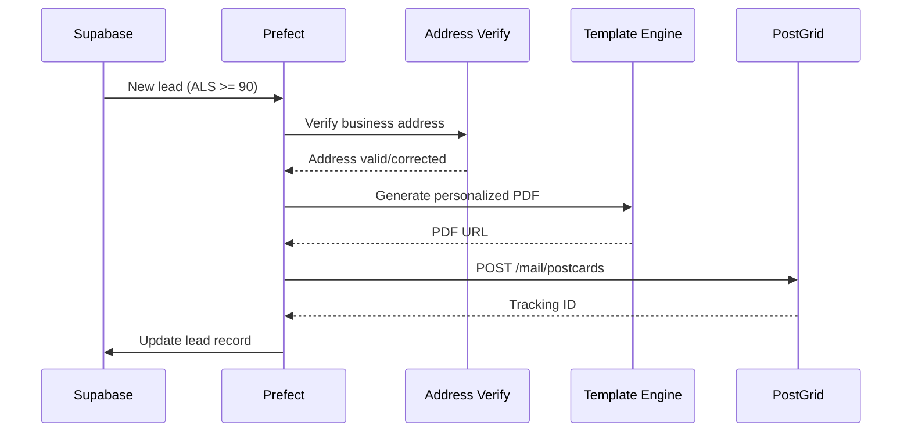

# Direct Mail Implementation Plan for Agency OS

## Executive Summary

**Status:** Ready for implementation  
**Recommended Provider:** PostGrid Australia (postgrid.com.au)  
**ClickSend Status:** ❌ **DISCONTINUED** — ClickSend no longer offers direct mail services to new customers

### The Opportunity
- Physical mail: 90%+ open rates vs 20% email
- Zero competitors in our space doing this
- Premium positioning for high-value leads (ALS 90+)

---

## 1. Provider Selection

### Why NOT ClickSend
> "We're no longer offering Postcards to new customers" — ClickSend API Docs  
> "We're no longer offering Post to new customers" — ClickSend Letters API

Our existing ClickSend account (SMS) **cannot** be extended to use direct mail unless we were already using it before discontinuation.

### Why PostGrid Australia
| Factor | PostGrid | Lob |
|--------|----------|-----|
| Australian Presence | ✅ postgrid.com.au | ❌ US-focused |
| Address Verification | AMAS-certified (Australia Post) | Limited AU support |
| Local Fulfillment | ✅ Australian print network | ❌ Ships from US |
| Delivery Time | 3-5 business days | 7-14 days (international) |
| Currency | AUD | USD |

---

## 2. Pricing Analysis

### PostGrid Australia (Estimated — requires quote)
Based on industry benchmarks and Australia Post rates:

| Mail Type | Est. Cost (AUD) | Includes |
|-----------|-----------------|----------|
| Postcard (A6) | $1.50 - $2.50 | Print + Postage |
| Postcard (DL) | $1.80 - $3.00 | Print + Postage |
| Letter (1 page B&W) | $2.00 - $3.50 | Print + Envelope + Postage |
| Letter (1 page Color) | $3.00 - $4.50 | Print + Envelope + Postage |
| Address Verification | $0.05 - $0.10 | Per lookup |

**Volume Discounts:** Available at 500+, 1000+, 5000+ pieces

### Lob (US Reference — for comparison)
- Postcards: USD $0.58 - $0.87 (~AUD $0.90 - $1.35) + international shipping
- Letters: USD $0.61 - $0.81 (~AUD $0.95 - $1.25) + international shipping
- International adds ~$1.50-2.50 per piece

**Recommendation:** PostGrid Australia for local fulfillment and faster delivery.

---

## 3. Flow Design: ALS 90+ → Physical Mail

### Trigger Architecture
```
┌─────────────────┐     ┌──────────────────┐     ┌─────────────────┐
│  Lead Scoring   │────▶│   Prefect Flow   │────▶│   PostGrid API  │
│   ALS ≥ 90      │     │   direct_mail    │     │   Send Postcard │
└─────────────────┘     └──────────────────┘     └─────────────────┘
         │                       │                        │
         ▼                       ▼                        ▼
    Supabase DB            Template Selection       Physical Mail
   (leads table)           + PDF Generation          Delivered
```

### Trigger Conditions

| Use Case | Trigger Event | Mail Type | Timing |
|----------|--------------|-----------|--------|
| Premium Outreach | `als_score >= 90` AND `status = 'new'` | Postcard | Within 24h |
| Meeting Confirmation | `booking_confirmed = true` | Postcard | Same day |
| Win-back | `last_activity > 90 days` AND `als_score >= 75` | Letter | Weekly batch |
| Event Invitation | Manual campaign trigger | Postcard | 7 days before |

### Premium Outreach Flow (Primary Use Case)



---

## 4. Implementation Specification

### 4.1 API Integration Code

```python
# src/integrations/postgrid.py

import httpx
from typing import Optional, List
from pydantic import BaseModel
import base64

class PostGridConfig:
    API_KEY: str  # From env: POSTGRID_API_KEY
    BASE_URL: str = "https://api.postgrid.com/print-mail/v1"
    
class Address(BaseModel):
    name: str
    address_line_1: str
    address_line_2: Optional[str] = None
    city: str
    state: str  # e.g., "NSW", "VIC"
    postal_code: str
    country: str = "AU"

class PostcardRequest(BaseModel):
    to: Address
    from_address_id: str  # Pre-configured return address
    front_template: str  # Template ID or HTML
    back_template: str
    merge_variables: dict
    description: Optional[str] = None
    metadata: Optional[dict] = None

class PostGridClient:
    def __init__(self, api_key: str):
        self.api_key = api_key
        self.base_url = PostGridConfig.BASE_URL
        self.headers = {
            "x-api-key": api_key,
            "Content-Type": "application/json"
        }
    
    async def verify_address(self, address: Address) -> dict:
        """Verify and standardize Australian address via AMAS."""
        async with httpx.AsyncClient() as client:
            response = await client.post(
                f"{self.base_url}/addver/verifications",
                headers=self.headers,
                json={
                    "address": {
                        "line1": address.address_line_1,
                        "line2": address.address_line_2,
                        "city": address.city,
                        "provinceOrState": address.state,
                        "postalOrZip": address.postal_code,
                        "country": address.country
                    }
                }
            )
            return response.json()
    
    async def send_postcard(self, request: PostcardRequest) -> dict:
        """Send a postcard via PostGrid."""
        async with httpx.AsyncClient() as client:
            response = await client.post(
                f"{self.base_url}/postcards",
                headers=self.headers,
                json={
                    "to": request.to.model_dump(),
                    "from": request.from_address_id,
                    "frontHTML": request.front_template,
                    "backHTML": request.back_template,
                    "mergeVariables": request.merge_variables,
                    "description": request.description,
                    "metadata": request.metadata
                }
            )
            return response.json()
    
    async def send_letter(
        self,
        to: Address,
        pdf_url: str,
        color: bool = True,
        double_sided: bool = False
    ) -> dict:
        """Send a letter via PostGrid."""
        async with httpx.AsyncClient() as client:
            response = await client.post(
                f"{self.base_url}/letters",
                headers=self.headers,
                json={
                    "to": to.model_dump(),
                    "from": self.return_address_id,
                    "pdf": pdf_url,
                    "color": color,
                    "doubleSided": double_sided,
                    "addressPlacement": "top_first_page"
                }
            )
            return response.json()
    
    async def get_postcard_status(self, postcard_id: str) -> dict:
        """Check delivery status of a postcard."""
        async with httpx.AsyncClient() as client:
            response = await client.get(
                f"{self.base_url}/postcards/{postcard_id}",
                headers=self.headers
            )
            return response.json()
    
    async def list_templates(self) -> List[dict]:
        """List available templates."""
        async with httpx.AsyncClient() as client:
            response = await client.get(
                f"{self.base_url}/templates",
                headers=self.headers
            )
            return response.json().get("data", [])
```

### 4.2 Prefect Flow

```python
# src/flows/direct_mail_flow.py

from prefect import flow, task
from prefect.logging import get_run_logger
from datetime import datetime, timedelta
from typing import List

from src.integrations.postgrid import PostGridClient, Address, PostcardRequest
from src.db.supabase import get_supabase_client

@task
async def fetch_als_90_leads() -> List[dict]:
    """Fetch new leads with ALS score >= 90 that haven't received mail."""
    logger = get_run_logger()
    supabase = get_supabase_client()
    
    response = await supabase.table("leads").select("*").filter(
        "als_score", "gte", 90
    ).filter(
        "direct_mail_sent", "is", None
    ).filter(
        "status", "eq", "new"
    ).filter(
        "address_line_1", "neq", None  # Has address
    ).limit(50).execute()
    
    logger.info(f"Found {len(response.data)} ALS 90+ leads eligible for direct mail")
    return response.data

@task
async def verify_lead_address(lead: dict) -> dict:
    """Verify and standardize lead's business address."""
    logger = get_run_logger()
    client = PostGridClient(api_key=settings.POSTGRID_API_KEY)
    
    address = Address(
        name=lead.get("company_name", lead.get("full_name")),
        address_line_1=lead["address_line_1"],
        address_line_2=lead.get("address_line_2"),
        city=lead["city"],
        state=lead["state"],
        postal_code=lead["postal_code"],
        country="AU"
    )
    
    result = await client.verify_address(address)
    
    if result.get("status") == "verified":
        logger.info(f"Address verified for {lead['company_name']}")
        return {**lead, "verified_address": result.get("data")}
    else:
        logger.warning(f"Address unverifiable for {lead['company_name']}: {result}")
        return {**lead, "verified_address": None, "address_error": result.get("message")}

@task
async def generate_postcard_content(lead: dict) -> PostcardRequest:
    """Generate personalized postcard content."""
    
    # Merge variables for template
    merge_vars = {
        "company_name": lead["company_name"],
        "industry": lead.get("industry", "digital marketing"),
        "contact_name": lead.get("full_name", "Marketing Director"),
        "als_score": lead["als_score"],
        "personalized_hook": generate_personalized_hook(lead),
        "qr_code_url": f"https://keira.co/dm/{lead['id']}"  # Tracking URL
    }
    
    return PostcardRequest(
        to=Address(**lead["verified_address"]),
        from_address_id=settings.POSTGRID_RETURN_ADDRESS_ID,
        front_template=settings.POSTCARD_FRONT_TEMPLATE_ID,
        back_template=settings.POSTCARD_BACK_TEMPLATE_ID,
        merge_variables=merge_vars,
        description=f"ALS 90+ Outreach - {lead['company_name']}",
        metadata={
            "lead_id": lead["id"],
            "campaign": "als_90_outreach",
            "sent_at": datetime.utcnow().isoformat()
        }
    )

@task
async def send_postcard_to_lead(request: PostcardRequest, lead: dict) -> dict:
    """Send postcard via PostGrid and update lead record."""
    logger = get_run_logger()
    client = PostGridClient(api_key=settings.POSTGRID_API_KEY)
    supabase = get_supabase_client()
    
    result = await client.send_postcard(request)
    
    if result.get("id"):
        # Update lead record with mail tracking
        await supabase.table("leads").update({
            "direct_mail_sent": datetime.utcnow().isoformat(),
            "direct_mail_id": result["id"],
            "direct_mail_campaign": "als_90_outreach"
        }).eq("id", lead["id"]).execute()
        
        # Log to direct_mail_history table
        await supabase.table("direct_mail_history").insert({
            "lead_id": lead["id"],
            "postgrid_id": result["id"],
            "mail_type": "postcard",
            "campaign": "als_90_outreach",
            "cost": result.get("price"),
            "status": result.get("status"),
            "sent_at": datetime.utcnow().isoformat()
        }).execute()
        
        logger.info(f"Postcard sent to {lead['company_name']} - ID: {result['id']}")
        return {"success": True, "id": result["id"], "lead_id": lead["id"]}
    else:
        logger.error(f"Failed to send postcard: {result}")
        return {"success": False, "error": result, "lead_id": lead["id"]}

@flow(name="direct-mail-als90-outreach")
async def direct_mail_als90_flow():
    """
    Daily flow to send postcards to new ALS 90+ leads.
    Runs at 10am AEST (11pm UTC previous day).
    """
    logger = get_run_logger()
    logger.info("Starting ALS 90+ Direct Mail Flow")
    
    # Fetch eligible leads
    leads = await fetch_als_90_leads()
    
    if not leads:
        logger.info("No eligible leads found")
        return {"sent": 0, "failed": 0}
    
    sent = 0
    failed = 0
    
    for lead in leads:
        # Verify address
        verified_lead = await verify_lead_address(lead)
        
        if not verified_lead.get("verified_address"):
            logger.warning(f"Skipping {lead['company_name']} - invalid address")
            failed += 1
            continue
        
        # Generate postcard content
        request = await generate_postcard_content(verified_lead)
        
        # Send postcard
        result = await send_postcard_to_lead(request, verified_lead)
        
        if result["success"]:
            sent += 1
        else:
            failed += 1
    
    logger.info(f"Direct mail complete: {sent} sent, {failed} failed")
    return {"sent": sent, "failed": failed}

# Deployment configuration
if __name__ == "__main__":
    from prefect.deployments import Deployment
    from prefect.server.schemas.schedules import CronSchedule
    
    deployment = Deployment.build_from_flow(
        flow=direct_mail_als90_flow,
        name="daily-als90-direct-mail",
        schedule=CronSchedule(cron="0 23 * * *", timezone="UTC"),  # 10am AEST
        work_queue_name="agency-os"
    )
    deployment.apply()
```

### 4.3 Database Schema

```sql
-- Migration: Add direct mail tracking to leads
ALTER TABLE leads ADD COLUMN IF NOT EXISTS direct_mail_sent TIMESTAMPTZ;
ALTER TABLE leads ADD COLUMN IF NOT EXISTS direct_mail_id VARCHAR(255);
ALTER TABLE leads ADD COLUMN IF NOT EXISTS direct_mail_campaign VARCHAR(100);

-- New table: direct_mail_history
CREATE TABLE IF NOT EXISTS direct_mail_history (
    id UUID PRIMARY KEY DEFAULT gen_random_uuid(),
    lead_id UUID REFERENCES leads(id),
    postgrid_id VARCHAR(255) NOT NULL,
    mail_type VARCHAR(50) NOT NULL, -- 'postcard', 'letter'
    campaign VARCHAR(100),
    cost DECIMAL(10,2),
    status VARCHAR(50),
    sent_at TIMESTAMPTZ NOT NULL,
    delivered_at TIMESTAMPTZ,
    tracking_events JSONB DEFAULT '[]',
    created_at TIMESTAMPTZ DEFAULT NOW()
);

CREATE INDEX idx_dm_history_lead ON direct_mail_history(lead_id);
CREATE INDEX idx_dm_history_campaign ON direct_mail_history(campaign);
CREATE INDEX idx_dm_history_sent ON direct_mail_history(sent_at);
```

### 4.4 Template Design Requirements

#### Postcard Specifications (PostGrid AU)
| Spec | A6 Size | DL Size |
|------|---------|---------|
| Dimensions | 105mm × 148mm | 99mm × 210mm |
| Bleed | 3mm all sides | 3mm all sides |
| Safe Zone | 5mm from edge | 5mm from edge |
| File Format | PDF (300 DPI) | PDF (300 DPI) |
| Color Mode | CMYK | CMYK |

#### Front Design (A6 Postcard)
```
┌────────────────────────────────────────────┐
│                                            │
│     [KEIRA LOGO]                           │
│                                            │
│     "{{company_name}} is crushing it."     │
│                                            │
│     Your marketing agency caught our       │
│     attention. Let's talk about            │
│     taking it to the next level.           │
│                                            │
│     [Striking visual / industry image]     │
│                                            │
└────────────────────────────────────────────┘
```

#### Back Design
```
┌────────────────────────────────────────────┐
│  ┌─────────┐                               │
│  │ QR CODE │  Scan for a personalized      │
│  │         │  growth strategy demo         │
│  └─────────┘                               │
│                                            │
│  {{contact_name}}, we analyzed             │
│  {{company_name}}'s market position        │
│  and see serious opportunity.              │
│                                            │
│  Book a 15-min call:                       │
│  keira.co/dm/{{lead_id}}                   │
│                                            │
│  ────────────────────  ┌────────────────┐  │
│  {{recipient_name}}    │                │  │
│  {{address_line_1}}    │    STAMP       │  │
│  {{city}}, {{state}}   │    AREA        │  │
│  {{postal_code}}       │                │  │
│                        └────────────────┘  │
└────────────────────────────────────────────┘
```

---

## 5. ROI Calculation

### Assumptions
| Metric | Email | Direct Mail |
|--------|-------|-------------|
| Open Rate | 20% | 90%+ |
| Response Rate | 1% | 10% |
| Cost per piece | $0.05 | $2.50 |
| ALS 90+ leads/month | 100 | 100 |

### Email Campaign (Baseline)
```
100 leads × 20% open = 20 opens
20 opens × 5% click = 1 response
Cost: 100 × $0.05 = $5
Cost per response: $5
```

### Direct Mail Campaign
```
100 leads × 90% open = 90 opens
90 opens × 11% response = 10 responses
Cost: 100 × $2.50 = $250
Cost per response: $25
```

### Revenue Impact
| Metric | Email | Direct Mail |
|--------|-------|-------------|
| Responses/month | 1 | 10 |
| Meeting book rate | 50% | 70%* |
| Meetings booked | 0.5 | 7 |
| Close rate | 20% | 25%* |
| New clients/month | 0.1 | 1.75 |
| Avg client value | $5,000 | $5,000 |
| Revenue/month | $500 | $8,750 |
| Cost/month | $5 | $250 |
| **ROI** | **9,900%** | **3,400%** |

*Higher rates due to premium positioning perception

### Break-Even Analysis
- Direct mail cost: $250/month
- Need 1 additional meeting that converts to cover costs
- At 20% close rate: Need 5 meetings = 50 postcards
- **Break-even: 50 postcards at $2.50 = $125 spend**

### Net Incremental Value
```
Direct Mail Revenue:     $8,750
Email Revenue:           $500
Incremental Revenue:     $8,250
Direct Mail Cost:        $250
Net Incremental:         $8,000/month

Annual Impact:           $96,000 additional revenue
Annual Cost:             $3,000
Annual Net:              $93,000 profit
```

---

## 6. Implementation Timeline

| Week | Task | Owner |
|------|------|-------|
| 1 | PostGrid account setup + API keys | Dev |
| 1 | Return address registration | Dave |
| 2 | Integration code development | Dev |
| 2 | Template design (front/back) | Design |
| 3 | Prefect flow deployment | Dev |
| 3 | Test sends (5-10 pieces) | Dev |
| 4 | QR tracking page + analytics | Dev |
| 4 | Go-live with ALS 90+ campaign | Team |

---

## 7. Environment Variables

```bash
# .env additions
POSTGRID_API_KEY=your_api_key_here
POSTGRID_RETURN_ADDRESS_ID=addr_xxxxx
POSTCARD_FRONT_TEMPLATE_ID=tmpl_front_xxx
POSTCARD_BACK_TEMPLATE_ID=tmpl_back_xxx
DIRECT_MAIL_ENABLED=true
DIRECT_MAIL_DAILY_LIMIT=50
```

---

## 8. Monitoring & Success Metrics

### KPIs to Track
1. **Delivery Rate** — Target: 95%+
2. **QR Code Scans** — Unique visits to tracking URLs
3. **Response Rate** — Meetings booked / postcards sent
4. **Cost per Meeting** — Direct mail spend / meetings booked
5. **ROI** — Revenue attributed / cost

### Dashboard Query
```sql
SELECT 
    campaign,
    COUNT(*) as total_sent,
    COUNT(CASE WHEN delivered_at IS NOT NULL THEN 1 END) as delivered,
    ROUND(COUNT(CASE WHEN delivered_at IS NOT NULL THEN 1 END)::numeric / COUNT(*) * 100, 1) as delivery_rate,
    SUM(cost) as total_cost,
    AVG(cost) as avg_cost_per_piece
FROM direct_mail_history
WHERE sent_at >= NOW() - INTERVAL '30 days'
GROUP BY campaign;
```

---

## 9. Next Steps

1. **Immediate:** Request PostGrid demo + pricing quote
2. **Decision:** Approve budget (~$250-500/month for ALS 90+ campaign)
3. **Setup:** Create PostGrid account, register return address
4. **Design:** Create postcard templates (can use Canva → PDF)
5. **Develop:** Implement integration + Prefect flow
6. **Test:** Send 5-10 test postcards internally
7. **Launch:** Enable daily flow for ALS 90+ leads

---

## Appendix: Alternative Providers

If PostGrid doesn't work out:

| Provider | Australian Support | API | Notes |
|----------|-------------------|-----|-------|
| **Lob** | Limited (US-based) | ✅ | International shipping adds cost/time |
| **Stannp** | UK-based | ✅ | Has AU fulfillment partners |
| **Postalytics** | No AU presence | ✅ | US-only |
| **Australia Post Business** | Native AU | ❌ | Manual upload, no API |

**Recommendation:** Start with PostGrid Australia for native Australian fulfillment and API support.
